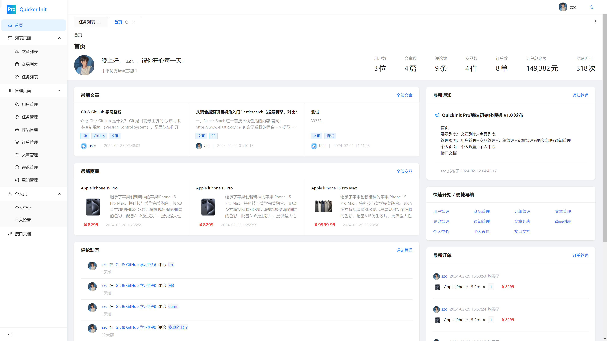

<div align="center">  </a> <br> <br>


<h1>QuickInit Pro - Frontend</h1>

</div>

## 介绍

QuickInit
Pro是一个基于Vue3、Vite4、ant-design-vue4、Pinia、UnoCSS和Typescript的一整套企业级中后台前端/设计解决方案，它参考了阿里react版本antd-pro的设计模式，使用了最新最流行的前端技术栈，内置了动态路由、多主题、多布局等功能，可以帮助你快速搭建企业级中后台产品原型。



## 特性

* pnpm：使用了最新的pnpm作为包管理工具，它可以大大减少node_modules的体积，加快包的安装速度，同时还可以共享依赖，减少磁盘占用。
* vite：vite作为前端开发工具，它可以大大加快项目的启动速度，同时还支持热更新，可以大大提高开发效率。
* vue3：vue3.3.x作为前端框架，基础代码全部使用script-setup的写法，代码量少维护成本低。
* nitro mock：采用nitro作为服务端的mock数据，从工程中解耦处理，更加灵活易用。
* ant-design-vue4：ant-design-vue4作为UI框架，admin-pro的作者也是ant-design-vue的核心成员，可提供长期的维护支持。
* pinia：pinia作为状态管理工具，它可以大大提高代码的可读性和可维护性，同时还支持Typescript。
* UnoCSS：原子化的CSS框架，减少我们去想一些通用类名带来的烦恼，提升我们的开发效率。
* 代码规范：我们封装了一套基于eslint的代码规范配置文件，开箱即用，统一不同团队所带来的问题。
* 主题：延用了react版本的antd-pro的设计规范，开发了一套基于vue的主题模式，在此基础上增加了一些新的功能，尽可能的满足各种不同的需求。
* 请求函数：基于axios封装了一套具有完善类型的请求函数，以及一些基础的拦截器的封装，只需要按照需求做对应的实现调整就能满足各种项目带来的不一样的需求。
* 移动端兼容：基础框架部分我们尽可能的对移动端的模式进行了兼容处理，但是由于我们的主要目标是企业级中后台产品，所以我们并没有对移动端做过多的适配，如果你的项目需要移动端的适配，可以参考我们的代码进行相应的调整。

## 使用

```bash
# 切换到项目目录
cd [your project name]

# 安装依赖

pnpm install

# 启动项目
pnpm dev
```
